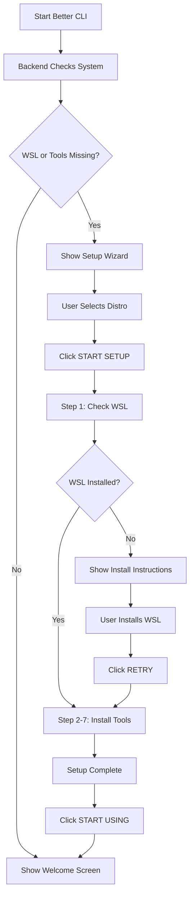

# Quick Start - Standalone Setup

## What This Does

The setup page is now a **completely standalone application** that:
- Works even if WSL is **not installed**
- Installs WSL if needed
- Sets up your entire development environment
- Doesn't require anything to be working first

## How to Run

### Step 1: Start Better CLI

```bash
cd e:\better-cli
start.bat
```

Or double-click `start-silent.vbs`

### Step 2: The Setup Wizard Appears

The setup will **automatically show** because it detects nothing is installed yet.

### Step 3: Follow the Wizard

```
┌─────────────────────────────────────────────┐
│  🚀 WSL SETUP                               │
│  Initialize your WSL environment            │
├─────────────────────────────────────────────┤
│                                             │
│  Step 1: Select WSL Distribution           │
│                                             │
│  Choose the Linux distribution to set up   │
│                                             │
│  ┌─────────────────────────────────────┐  │
│  │  Ubuntu                [DEFAULT] ✓  │  │
│  │  Running • WSL 2                    │  │
│  └─────────────────────────────────────┘  │
│                                             │
│  What will be installed:                   │
│  • WSL (if not installed)                  │
│  • Selected Linux Distribution             │
│  • Sudo, cURL, Node.js, npm                │
│  • Configured development environment      │
│                                             │
│                     [🚀 START SETUP]       │
└─────────────────────────────────────────────┘
```

### Step 4: Watch Installation Progress

The setup runs **7 sequential steps**:

1. ✓ **Check WSL Installation** - Verifies WSL is installed
2. ✓ **Initialize WSL Distribution** - Starts your selected distro
3. ✓ **Verify Sudo Access** - Checks privileges
4. ✓ **Install cURL** - Installs download tool
5. ✓ **Install Node.js & npm** - Installs runtime
6. ✓ **Configure npm** - Sets up global packages
7. ✓ **Verify Installation** - Confirms everything works

Each step shows:
- ⚪ Pending (gray circle)
- 🔵 Running (spinning loader)
- ✅ Complete (green checkmark)
- ❌ Error (red alert with details)

### Step 5: Setup Complete!

```
┌─────────────────────────────────────────────┐
│              ✅ (large icon)                │
│                                             │
│          SETUP COMPLETE!                    │
│                                             │
│  Your WSL environment is ready              │
│                                             │
│  ✓ WSL          ✓ Node.js                  │
│  ✓ Sudo         ✓ npm                      │
│  ✓ cURL         ✓ PATH configured          │
│                                             │
│              [START USING BETTER CLI]       │
└─────────────────────────────────────────────┘
```

Click **"START USING BETTER CLI"** to begin!

## What If WSL Is Not Installed?

If WSL is not installed, the setup will:

1. **Detect WSL is missing** at Step 1
2. **Show clear instructions**:
   ```
   ❌ WSL is not installed
   
   Please install it first:
   
   1. Open PowerShell as Administrator
   2. Run: wsl --install
   3. Restart your computer
   4. Come back and run this setup again
   ```

3. **Provide "RETRY" button** after you install WSL

## Manual Setup Access

You can also run setup manually anytime:

1. **Go to Settings** (⚙️ icon in sidebar)
2. **Click "RUN SETUP"** button (green button in WSL Management)
3. **Follow the wizard**

## Setup Flow Diagram



## What Gets Installed

### 1. WSL (if needed)
- Windows Subsystem for Linux
- Your selected distribution (Ubuntu, Fedora, etc.)

### 2. Essential Tools
- **sudo** - Run commands with elevated privileges
- **cURL** - Download files and make HTTP requests
- **Node.js v20 LTS** - JavaScript runtime
- **npm** - Node package manager

### 3. Configuration
- npm global directory: `~/.npm-global`
- PATH configured in `~/.bashrc`
- fnm (Fast Node Manager) for Node.js versioning

## Typical Setup Time

- **WSL Already Installed**: 2-3 minutes
- **WSL Not Installed**: 5-10 minutes (includes WSL installation + restart)

## Troubleshooting

### Setup Fails at Step 1 (WSL Check)

**Solution:**
1. Open PowerShell as Administrator
2. Run: `wsl --install`
3. Restart computer
4. Run Better CLI setup again

### Setup Fails at Later Steps

**Solution:**
- Check your internet connection
- Ensure WSL is running (not stopped)
- Click **RETRY** or run setup again from Settings

### Can't See Setup Page

**Reasons:**
- All tools are already installed
- Setup was completed before

**Solution:**
- Go to Settings → WSL Management
- Click "RUN SETUP" to run again

## Benefits of Standalone Setup

✅ **Zero Prerequisites** - Doesn't need WSL or tools installed first  
✅ **Guided Experience** - Clear instructions at every step  
✅ **Error Recovery** - Shows what went wrong and how to fix it  
✅ **One-Click** - Just select distro and click Start  
✅ **Progress Tracking** - Watch each step execute in real-time  
✅ **Safe** - Uses official package managers and tools  
✅ **Fast** - Automated installation saves time  

---

**You're ready to go! Just run `start.bat` and the setup will guide you through everything.** 🚀
