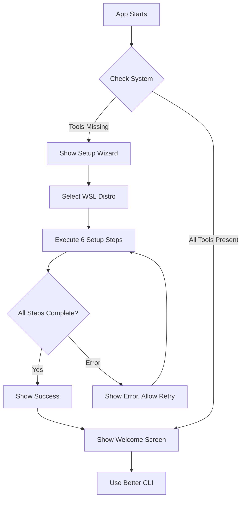

# WSL Setup Feature - Implementation Summary

## Overview
A comprehensive, user-friendly WSL initialization wizard that guides users through setting up their WSL environment with essential development tools.

## Features Implemented

### 1. **Automatic Setup Detection**
- On app startup, checks if essential tools are installed
- Automatically shows setup wizard if missing:
  - Sudo
  - cURL
  - Node.js & npm

### 2. **Interactive Setup Wizard**

#### Stage 1: Distribution Selection
- Lists all available WSL distributions
- Shows current state (Running/Stopped)
- Highlights default distribution
- Auto-selects default distro for convenience

#### Stage 2: Progressive Installation
Six sequential installation steps with real-time progress:

1. **Initialize WSL Distribution**
   - Starts the selected WSL distro
   - Verifies it's accessible

2. **Verify Sudo Access**
   - Checks sudo is available
   - Required for package installation

3. **Install cURL**
   - Cross-distro installation (dnf/apt detection)
   - Essential for downloading packages

4. **Install Node.js & npm**
   - Uses Fast Node Manager (fnm)
   - Installs Node.js v20 LTS
   - Installs npm package manager

5. **Configure npm**
   - Sets up npm global prefix (`~/.npm-global`)
   - Adds PATH to `.bashrc`
   - Configures fnm environment

6. **Verify Installation**
   - Tests all installed tools
   - Shows versions
   - Confirms successful setup

#### Stage 3: Completion
- Success confirmation
- Summary of installed tools
- Button to start using Better CLI

### 3. **Visual Design**

**Progress Indicators:**
- ⚪ Pending (gray circle)
- 🔵 Running (spinning loader)
- ✅ Complete (green checkmark)
- ❌ Error (red alert icon)

**Real-time Output:**
- Each step shows command output
- Collapsible output panels
- Error messages highlighted in red
- Monospace font for technical output

**Color Scheme:**
- Primary: Cyan/Blue (`var(--accent-primary)`)
- Success: Green (`#4ade80`)
- Error: Red (`#ff6b6b`)
- Background: Dark theme matching Better CLI

### 4. **Backend API**

**Endpoint:** `POST /api/setup/execute-step`

**Request:**
```json
{
  "stepId": "install-node",
  "distro": "Ubuntu"
}
```

**Response (Success):**
```json
{
  "success": true,
  "output": "Node.js v20.10.0\nnpm 10.2.3\nNode.js and npm installed successfully"
}
```

**Response (Error):**
```json
{
  "success": false,
  "error": "curl: command not found",
  "output": "..."
}
```

**Step IDs:**
- `wsl-init` - Initialize WSL
- `check-sudo` - Verify sudo
- `install-curl` - Install cURL
- `install-node` - Install Node.js/npm via fnm
- `configure-npm` - Configure npm globals and PATH
- `verify` - Verify all tools

### 5. **Cross-Distribution Support**

**Supported Package Managers:**
- **DNF** (Fedora, RHEL, CentOS)
- **APT** (Ubuntu, Debian, WSL Ubuntu)

**Installation Commands:**
```bash
# Pattern used for all tools
if command -v dnf &> /dev/null; then
    sudo dnf install -y <package>
else
    sudo apt update && sudo apt install -y <package>
fi
```

### 6. **Manual Setup Access**

**From Settings Page:**
- Added "RUN SETUP" button to WSL Management section
- Users can re-run setup anytime
- Useful for troubleshooting or reinstalling tools

### 7. **Skip Logic**

**Setup is automatically skipped if:**
- All essential tools are already installed
- User has completed setup before (stored in state)

**User can choose to:**
- Run setup again from Settings
- Skip setup and use existing tools

## Technical Implementation

### Frontend (Setup.tsx)
- SolidJS component with reactive state
- Three-stage UI flow (select → installing → complete)
- Real-time progress tracking
- Error handling with retry capability

### Backend (server/index.js)
- Sequential step execution
- Uses `execWsl()` helper for WSL commands
- Cross-platform command detection
- Comprehensive error reporting

### Integration (App.tsx)
- Setup check on app startup
- Conditional rendering (setup vs main app)
- State management for setup completion
- Settings page integration

## User Flow



## Installation Commands Used

### cURL
```bash
if command -v dnf &> /dev/null; then 
    sudo dnf install -y curl
else 
    sudo apt update && sudo apt install -y curl
fi
```

### Node.js (via fnm)
```bash
# Download and install fnm
curl -fsSL https://github.com/Schniz/fnm/releases/latest/download/fnm-linux.zip -o /tmp/fnm.zip
unzip -o /tmp/fnm.zip -d "$HOME/.local/share/fnm"

# Install Node.js LTS
fnm install --lts
fnm alias default <version>
```

### npm Configuration
```bash
mkdir -p "$HOME/.npm-global"
npm config set prefix "$HOME/.npm-global"

# Add to .bashrc
echo 'export PATH="$HOME/.local/share/fnm:$PATH"' >> "$HOME/.bashrc"
echo 'eval "$(fnm env --shell bash)"' >> "$HOME/.bashrc"
echo 'export PATH="$HOME/.npm-global/bin:$PATH"' >> "$HOME/.bashrc"
```

## Error Handling

**Each step:**
- Wrapped in try-catch
- Returns success/error status
- Includes stdout/stderr output
- Stops on first error (doesn't continue to next step)

**User can:**
- View detailed error messages
- See command output
- Retry failed step
- Exit setup and troubleshoot manually

## Future Enhancements

**Potential Additions:**
1. **Passwordless Sudo Setup**
   - Automated visudo configuration
   - User confirmation dialog

2. **Additional Tools**
   - Git installation
   - Python/pip setup
   - Docker Engine

3. **Setup Profiles**
   - Minimal (current)
   - Full Stack (Node, Python, Docker)
   - Custom (user selects tools)

4. **Progress Persistence**
   - Save setup progress
   - Resume interrupted setup
   - Skip completed steps

5. **Rollback Capability**
   - Undo installation steps
   - Restore previous state

## Testing

**To Test:**
1. Start Better CLI on fresh WSL installation
2. Verify setup wizard appears
3. Select a WSL distribution
4. Watch each step execute
5. Verify tools are installed:
   ```bash
   sudo --version
   curl --version
   node -v
   npm -v
   ```

**To Re-test:**
1. Go to Settings → WSL Management
2. Click "RUN SETUP" button
3. Follow wizard again

## Files Changed

### New Files
- `client/src/Setup.tsx` - Setup wizard component
- `SETUP_FEATURE.md` - This documentation

### Modified Files
- `client/src/App.tsx` - Setup integration
- `client/src/App.css` - Spinner animation
- `client/src/Settings.tsx` - Manual setup button
- `server/index.js` - Setup API endpoint

### Lines of Code
- Frontend: ~560 lines (Setup.tsx)
- Backend: ~110 lines (API endpoint)
- Integration: ~30 lines
- **Total: ~700 lines**

## Benefits

✅ **User-Friendly** - No command-line knowledge required  
✅ **Automated** - One-click setup process  
✅ **Informative** - Real-time progress and output  
✅ **Cross-Platform** - Works on Ubuntu, Fedora, etc.  
✅ **Robust** - Error handling and retry logic  
✅ **Fast** - Typical setup time: 2-3 minutes  
✅ **Safe** - Uses official package managers and tools  

---

**Ready to use!** 🚀
