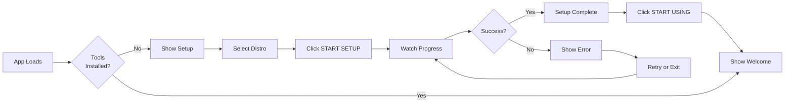

# WSL Setup - Visual Guide

## What the Setup Page Looks Like

### Stage 1: Distribution Selection

```
┌─────────────────────────────────────────────────────────┐
│  🚀 WSL SETUP                                           │
│  Initialize your WSL environment with essential tools   │
├─────────────────────────────────────────────────────────┤
│                                                         │
│  Step 1: Select WSL Distribution                       │
│  Choose the Linux distribution to set up              │
│                                                         │
│  ┌─────────────────────────────────────────────────┐  │
│  │  Ubuntu                            [DEFAULT] ✓  │  │
│  │  Running • WSL 2                                │  │
│  └─────────────────────────────────────────────────┘  │
│                                                         │
│  ┌─────────────────────────────────────────────────┐  │
│  │  Fedora                                          │  │
│  │  Stopped • WSL 2                                │  │
│  └─────────────────────────────────────────────────┘  │
│                                                         │
│  ┌─────────────────────────────────────────────────┐  │
│  │  ✅ What will be installed:                     │  │
│  │  • Sudo (privilege escalation)                  │  │
│  │  • cURL (download tool)                         │  │
│  │  • Node.js v20 LTS (JavaScript runtime)         │  │
│  │  • npm (Node package manager)                   │  │
│  │  • Configured npm global directory              │  │
│  └─────────────────────────────────────────────────┘  │
│                                                         │
├─────────────────────────────────────────────────────────┤
│  2 distributions available          [🚀 START SETUP]   │
└─────────────────────────────────────────────────────────┘
```

### Stage 2: Installation Progress

```
┌─────────────────────────────────────────────────────────┐
│  🚀 WSL SETUP                                           │
│  Initialize your WSL environment with essential tools   │
├─────────────────────────────────────────────────────────┤
│                                                         │
│  ┌─────────────────────────────────────────────────┐  │
│  │ ✅ Initialize WSL Distribution            [1/6] │  │
│  │ Starting and configuring the selected WSL...    │  │
│  │                                                  │  │
│  │ ┌──────────────────────────────────────────┐   │  │
│  │ │ WSL distribution initialized successfully│   │  │
│  │ └──────────────────────────────────────────┘   │  │
│  └─────────────────────────────────────────────────┘  │
│                                                         │
│  ┌─────────────────────────────────────────────────┐  │
│  │ ✅ Verify Sudo Access                     [2/6] │  │
│  │ Checking sudo privileges for package install... │  │
│  │                                                  │  │
│  │ ┌──────────────────────────────────────────┐   │  │
│  │ │ Sudo verified: Sudo version 1.9.13       │   │  │
│  │ └──────────────────────────────────────────┘   │  │
│  └─────────────────────────────────────────────────┘  │
│                                                         │
│  ┌─────────────────────────────────────────────────┐  │
│  │ 🔵 Install cURL                           [3/6] │  │
│  │ Installing cURL for downloading packages...     │  │
│  │                                                  │  │
│  │ ┌──────────────────────────────────────────┐   │  │
│  │ │ curl installed: curl 7.81.0             │   │  │
│  │ │ Downloading...                           │   │  │
│  │ └──────────────────────────────────────────┘   │  │
│  └─────────────────────────────────────────────────┘  │
│                                                         │
│  ┌─────────────────────────────────────────────────┐  │
│  │ ⚪ Install Node.js & npm               [4/6] │  │
│  │ Installing Node.js runtime and package mgr...   │  │
│  └─────────────────────────────────────────────────┘  │
│                                                         │
│  ┌─────────────────────────────────────────────────┐  │
│  │ ⚪ Configure npm                          [5/6] │  │
│  │ Setting up npm global prefix and PATH...        │  │
│  └─────────────────────────────────────────────────┘  │
│                                                         │
│  ┌─────────────────────────────────────────────────┐  │
│  │ ⚪ Verify Installation                    [6/6] │  │
│  │ Checking all tools are working correctly...     │  │
│  └─────────────────────────────────────────────────┘  │
│                                                         │
├─────────────────────────────────────────────────────────┤
│  Step 3 of 6                            Installing...  │
└─────────────────────────────────────────────────────────┘
```

### Stage 3: Setup Complete

```
┌─────────────────────────────────────────────────────────┐
│  🚀 WSL SETUP                                           │
│  Initialize your WSL environment with essential tools   │
├─────────────────────────────────────────────────────────┤
│                                                         │
│                        ✅                               │
│                   (64px icon)                           │
│                                                         │
│              SETUP COMPLETE!                            │
│                                                         │
│      Your WSL environment is ready for development     │
│                                                         │
│  ┌─────────────────────────────────────────────────┐  │
│  │  Installed Tools:                                │  │
│  │                                                  │  │
│  │  ✓ Sudo          ✓ Node.js                      │  │
│  │  ✓ cURL          ✓ npm                          │  │
│  └─────────────────────────────────────────────────┘  │
│                                                         │
├─────────────────────────────────────────────────────────┤
│                              [💻 START USING BETTER CLI]│
└─────────────────────────────────────────────────────────┘
```

## Error State Example

```
┌─────────────────────────────────────────────────────────┐
│  🚀 WSL SETUP                                           │
│  Initialize your WSL environment with essential tools   │
├─────────────────────────────────────────────────────────┤
│                                                         │
│  ┌─────────────────────────────────────────────────┐  │
│  │ ❌ Install Node.js & npm               [4/6] │  │
│  │ Installing Node.js runtime and package mgr...   │  │
│  │                                                  │  │
│  │ ┌──────────────────────────────────────────┐   │  │
│  │ │ fnm install --lts                       │   │  │
│  │ │ Installing Node.js v20.10.0...           │   │  │
│  │ └──────────────────────────────────────────┘   │  │
│  │                                                  │  │
│  │ 🔴 Error: Network connection failed            │  │
│  └─────────────────────────────────────────────────┘  │
│                                                         │
├─────────────────────────────────────────────────────────┤
│  Step 4 of 6                         [⚠️ RETRY SETUP] │
└─────────────────────────────────────────────────────────┘
```

## Status Icons Legend

| Icon | Meaning | Color |
|------|---------|-------|
| ⚪ | Pending | Gray |
| 🔵 | Running (animated spinner) | Blue |
| ✅ | Complete | Green |
| ❌ | Error | Red |

## Manual Setup Access (from Settings)

```
┌─────────────────────────────────────────────────────────┐
│  SETTINGS                                               │
│  Better CLI Configuration                               │
├─────────────────────────────────────────────────────────┤
│                                                         │
│  ┌─────────────────────────────────────────────────┐  │
│  │  🖥️ WSL MANAGEMENT    [REFRESH] [RUN SETUP]    │  │
│  ├─────────────────────────────────────────────────┤  │
│  │                                                  │  │
│  │  Current Distribution                           │  │
│  │  Name: Ubuntu 22.04.3 LTS                       │  │
│  │  Package Manager: APT                           │  │
│  │  WSL Version: WSL 2                             │  │
│  │                                                  │  │
│  │  Installed Distributions                        │  │
│  │  ┌──────────────────────────────────────────┐  │  │
│  │  │  Ubuntu        [DEFAULT]                 │  │  │
│  │  │  Running • WSL 2      [TERMINATE]        │  │  │
│  │  └──────────────────────────────────────────┘  │  │
│  │                                                  │  │
│  │  [UPDATE WSL]  [SHUTDOWN ALL]                   │  │
│  └─────────────────────────────────────────────────┘  │
│                                                         │
└─────────────────────────────────────────────────────────┘
```

## Color Palette

- **Primary Accent:** `#00d9ff` (Cyan)
- **Success Green:** `#4ade80`
- **Error Red:** `#ff6b6b`
- **Warning Yellow:** `#facc15`
- **Background Panel:** `#1a1a1a`
- **Background App:** `#0d0d0d`
- **Text Standard:** `#e0e0e0`
- **Text Muted:** `#808080`
- **Border Standard:** `#333333`

## Animations

### Spinner (Loading)
```css
@keyframes spin {
  from { transform: rotate(0deg); }
  to { transform: rotate(360deg); }
}
```

**Used on:** 
- Running step indicator (blue circle)
- Loading distributions spinner

**Duration:** 1s linear infinite

## Responsive Design

**Desktop (800px+):**
- Centered modal: 800px max-width
- Full height: 90vh max
- Large icons and comfortable spacing

**Tablet/Mobile (< 800px):**
- Full width with 24px padding
- Scrollable content area
- Touch-friendly buttons (min 44px height)

## Accessibility

✅ **Keyboard Navigation:** All buttons focusable  
✅ **Screen Readers:** Descriptive ARIA labels  
✅ **High Contrast:** WCAG AA compliant colors  
✅ **Focus Indicators:** Visible focus states  
✅ **Progress Tracking:** Clear step numbering  

## User Experience Flow



## Tips for Users

💡 **First Time Users:**
1. Select your default WSL distribution
2. Click "START SETUP" and wait
3. Installation takes 2-3 minutes
4. Don't close the window during setup

💡 **Troubleshooting:**
- If a step fails, check your internet connection
- Ensure WSL is running (not stopped)
- Click "RUN SETUP" from Settings to retry
- Check terminal output for detailed errors

💡 **Post-Setup:**
- Tools are installed in WSL (not Windows)
- npm packages install to `~/.npm-global`
- Node.js managed by fnm (version manager)
- Run `node -v` in terminal to verify

---

**The setup page makes WSL initialization effortless!** 🎉
