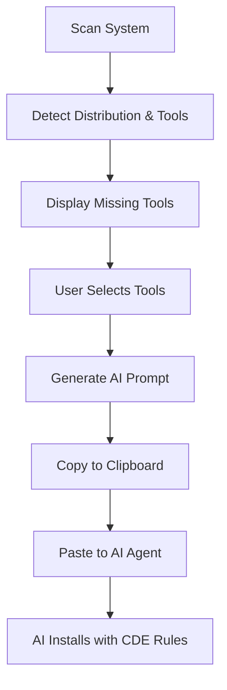

# Tools Manager 2.0 - AI-Assisted Installation System

## Overview

The redesigned Tools Manager solves cross-distribution compatibility issues by **generating AI-friendly prompts** instead of running fragile hardcoded installation commands.

## Key Improvements

### 1. **Broader Detection (Fewer False Negatives)**
- Each tool has **multiple detection commands** (not just one)
- Example: Node.js detected via `node`, `nodejs`, or `npm`
- Prevents missing installed tools due to naming variations

### 2. **System-Aware Detection**
- Detects WSL distribution (Ubuntu, Fedora, etc.)
- Identifies package manager (apt, dnf, yum)
- Checks prerequisite tools (sudo, curl, Node.js)

### 3. **AI-Powered Installation**
- User selects tools to install
- System generates comprehensive prompt for AI coding agent
- Prompt includes:
  - System environment details
  - Cross-distro installation patterns
  - CDE rules (Check-Detect-Execute)
  - Verification steps

## Workflow



## Architecture

### Client (ToolsNew.tsx)

**Components:**
- **System Info Display**: Shows distro, package manager, missing count
- **Tool Cards**: Checkboxes to select tools for installation
- **Prompt Generator**: Creates installation instructions
- **Prompt Display**: Shows generated prompt with copy button

**Tool Categories:**
1. **ESSENTIAL**: Core system tools (sudo, curl, git, package managers)
2. **DEVELOPMENT**: Runtimes and databases (Node.js, Python, Rust, Docker, PostgreSQL)
3. **AI TOOLS**: Coding assistants (GitHub CLI, Railway, Gemini)

### Server APIs

#### POST /api/tools/system-info
Returns system environment information:
```json
{
  "distro": "Ubuntu 22.04.3 LTS",
  "packageManager": "apt",
  "hasSudo": true,
  "hasCurl": true,
  "hasNode": false
}
```

#### POST /api/tools/detect-broad
Detects tool with multiple fallback commands:
```json
{
  "toolId": "nodejs",
  "detectCommands": ["node", "nodejs", "npm"]
}
```

Returns:
```json
{
  "id": "nodejs",
  "detected": true,
  "path": "/usr/bin/node",
  "version": "v20.10.0"
}
```

## Generated Prompt Structure

### 1. System Context
```
Environment: WSL (Windows Subsystem for Linux)
Distribution: Ubuntu 22.04 with APT package manager
Available Tools: sudo ✓, curl ✓, Node.js ✗
```

### 2. CDE Rules
```
CHECK: Verify tool isn't already installed
DETECT: Identify correct package manager
EXECUTE: Run installation with error handling
```

### 3. Cross-Distro Pattern
```bash
if command -v <tool> &> /dev/null; then
    echo "✓ already installed"
else
    if command -v dnf &> /dev/null; then
        sudo dnf install -y <package>
    else
        sudo apt update && sudo apt install -y <package>
    fi
fi
```

### 4. Tool List (Priority Order)
- Organized by installation dependencies
- Higher priority = install first
- Example: sudo (P1) before curl (P3)

### 5. Verification Commands
- Includes version checks for all tools
- AI can confirm successful installation

## Why This Approach?

### Problems with Old System
❌ Hardcoded commands break on different distros  
❌ Missing detection = false negatives  
❌ No error recovery  
❌ Assumes apt package manager  
❌ No installation context for complex setups  

### Benefits of New System
✅ **AI understands the context** (distro, existing tools)  
✅ **Flexible installation methods** (AI chooses best approach)  
✅ **Handles edge cases** (AI can troubleshoot)  
✅ **Cross-distribution compatible** (works on Fedora, Ubuntu, etc.)  
✅ **User reviews prompt** before execution  
✅ **Educational** - user learns installation process  

## Usage Example

### Step 1: Scan System
Click "RESCAN" to detect current tool status

### Step 2: Select Missing Tools
Click checkboxes to select tools you need:
- ✗ Node.js (not installed)
- ✗ Git (not installed)
- ✓ cURL (already installed - skip)

### Step 3: Generate Prompt
Click "GENERATE AI PROMPT" - creates tailored instructions

### Step 4: Copy & Paste
Click "COPY PROMPT" → Paste into your AI coding agent (Cursor, Copilot, Claude, etc.)

### Step 5: AI Executes
AI reads context, checks system, installs tools following CDE rules

### Step 6: Verify
Rescan to confirm installations

## Tool Definitions

Each tool has:
- **id**: Unique identifier
- **name**: Display name
- **description**: What it does
- **category**: essential | dev | ai
- **detectCommands**: Array of commands to detect (broader = better)
- **priority**: Installation order (1 = first, 30 = last)

## Adding New Tools

```typescript
{
    id: 'mytool',
    name: 'My Tool',
    description: 'What this tool does',
    category: 'dev',
    detectCommands: ['mytool', 'mytool-alt', 'my-tool'],
    priority: 15
}
```

## Future Enhancements

1. **Preset Groups**: "Frontend Dev", "Backend Dev", "Data Science"
2. **Custom Commands**: User-defined installation scripts
3. **Installation History**: Track what was installed when
4. **Auto-Verify**: Rescan after AI completes installation
5. **Template Library**: Prompt templates for different scenarios

## Migration from Old Tools Page

The old `Tools.tsx` is preserved for reference. The new `ToolsNew.tsx` is now active.

**Key Differences:**
- Old: Direct command execution → Fragile, distro-specific
- New: AI prompt generation → Flexible, educational, robust

## Technical Notes

### Detection Algorithm
1. Try each `detectCommand` in order
2. Use `command -v` and `which` for robustness
3. First success = detected
4. No success = not installed

### Priority System
- P1-P5: Essential system tools
- P10-P15: Development runtimes
- P20+: AI and specialty tools

### Error Handling
- Network failures → Graceful degradation
- Missing APIs → Show error message
- Invalid selections → Prevent prompt generation

---

**Built for Better CLI** - Making WSL development easier, one tool at a time.
